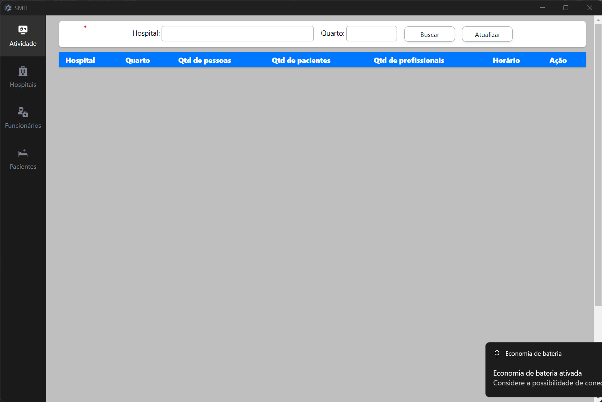
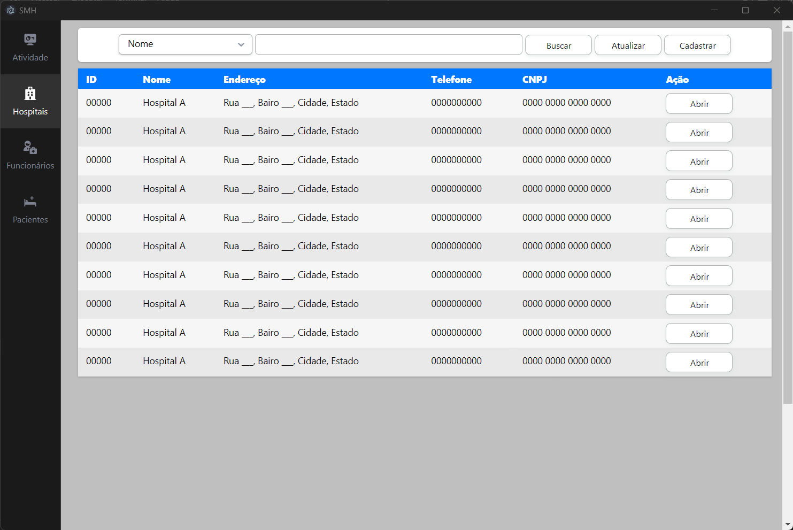
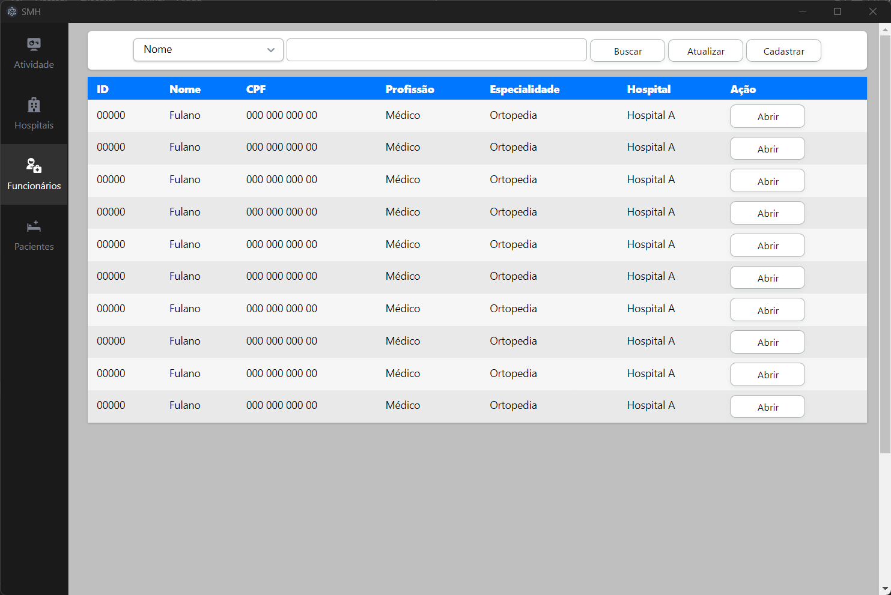
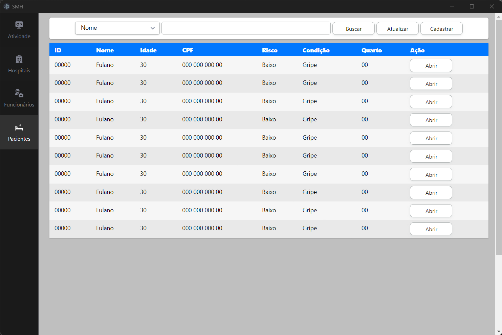

# Sistema de Monitoramento Hospitalar (SMH) - Desktop

Este aplicativo desktop, desenvolvido com o framework Electron.js, é um trabalho da disciplina "Projetos de Engenharia de Computação II", do curso de Engenharia de Computação da UFMT. 

## Integrantes do grupo (ordem alfabética)
* Alisson Cerutti
* André Reliquias
* Elton M Lima
* Filipe Chagas
* Giulianna Moretti
* Igor da Silva Carneiro
* Matheus de Souza Carvalho
* Michael Nunes Cardoso Macedo

## Para fazer
* Adicionar as páginas de cadastramento (janela separada)
* Adicionar páginas de visualização de cadastro (janela separada)
* Adicionar uma página de autenticação de usuário (janela separada)
* Adicionar uma página de visualização de atividade (janela separada)
* Adicionar a integração com o back-end

## Prints

